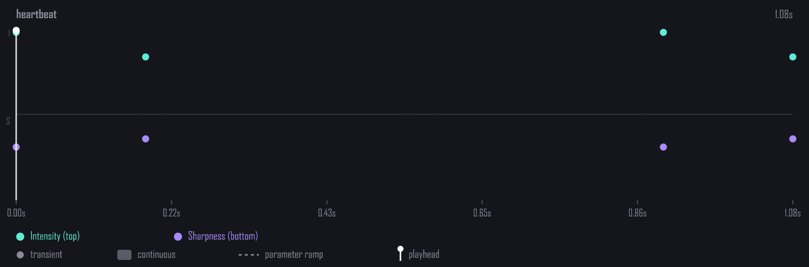
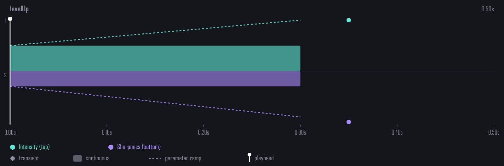

# capacitor-rich-haptics

[](https://github.com/sergey-faraday/capacitor-rich-haptics/actions/workflows/ci.yml)
[](https://www.npmjs.com/package/capacitor-rich-haptics)
[](./bench/RESULTS.md)
[](./LICENSE)

Native-quality haptic feedback for Capacitor — the same nuanced taps and textures you feel in first-party iOS apps, with a real Core Haptics engine, live parameter modulation, AHAP playback, native preloading, and a built-in pattern library.

<!--
  Pattern timelines below are rendered via the plugin's own renderHapticTimelineSVG.
  For real on-device recordings (drag-pad, recorder flow, etc.) see ./media/README.md.
-->

<p align="center">
  
  <br/>
  <em>The <code>heartbeat</code> pattern — four <code>HapticTransient</code> events, classic two-stage rhythm.</em>
</p>

<p align="center">
  
  <br/>
  <em>The <code>levelUp</code> pattern — sustained <code>HapticContinuous</code> with a rising intensity ramp, then a single accent tap.</em>
</p>

> The official `@capacitor/haptics` plugin only exposes the legacy `UIImpactFeedbackGenerator` API (Light / Medium / Heavy). This plugin gives you the full **Core Haptics** engine on iOS — custom intensity, sharpness, continuous vibrations, AHAP files, and **live parameter modulation** — and maps the same API to Android's modern **`VibrationEffect.Composition`** primitives.

## Features

- **Core Haptics** on iOS (`CHHapticEngine`) with custom intensity & sharpness
- **AHAP playback** from bundle file or runtime JSON string
- **Live parameter modulation** — change intensity/sharpness during playback (drag gestures, scrubbers, breathing exercises)
- **Preloading for hot paths** — pre-build native effects where the platform supports it; lowers start latency on iOS and Android 8+
- **Synchronized audio** — register audio resources, attach to AHAP `EventWaveformPath`
- **Built-in pattern library** — 60 ready-made AHAP patterns across 12 categories (game, music, camera, ui, social, mechanical, security, …)
- **Cross-platform UX presets** — **29 single-event presets** covering basic UI, UIKit impacts, selection/picker, gestures, notification family, toggle, UI actions, and specific physical metaphors (typing, collision, ambient loading)
- **Pattern Builder** — fluent TS API to compose AHAP patterns without writing JSON
- **Pattern transformations** — `combine`, `repeat`, `scale`, `stretch`, `reverse`, `delay`
- **React** — `useHaptics`, `useHapticScroll`, `useHapticDrag`, `useReducedMotion`, `<HapticButton>`, `<HapticPressable>`
- **Vue** — same set, idiomatic Composition API + components
- **Pattern recorder** — record `RichHaptics.*` calls during a gesture, save the trace, replay later (E2E fixtures, designer workflows)
- **Sequence builder** — `sequence(preset('softTap'), wait(200), preset('success')).play()` composes haptic timelines without setTimeout chains
- **App-wide kill switch** — `RichHaptics.setEnabled({ enabled: false })` makes every play call a no-op (wire to a settings toggle without sprinkling `if`s)
- **Global intensity scale** — `RichHaptics.setIntensityScale({ scale: 0.5 })` for "Haptic intensity" sliders (orthogonal to kill switch)
- **Tree-shakeable** — each of the 60 patterns is a top-level export; `"sideEffects": false` lets modern bundlers strip unused ones
- **Test utilities** — `createMockHaptics()` for Jest / Vitest
- **Engine reset events** — `RichHaptics.addListener('engineDidReset', ...)` to re-preload after audio session interruption
- **Android `VibrationEffect.Composition` primitives** (API 31+) — full set: `CLICK / TICK / LOW_TICK / THUD / SPIN / QUICK_RISE / SLOW_RISE / QUICK_FALL`, opt-in per event via `androidPrimitive: 'spin'` on the AHAP builder. Plus `EFFECT_CLICK / DOUBLE_CLICK / HEAVY_CLICK` predefined effects.
- **Web Audio fallback** — desktop preview via tiny audio clicks when no vibrator
- **Reduce Motion respect** — `isSupported()` reports `userEnabled: false` when iOS Reduce Motion is on
- **Engine lifecycle handled** — auto-restart on reset, pause on backgrounding

## Install

```bash
npm install capacitor-rich-haptics
npx cap sync
```

Requires Capacitor 6+. iOS 14+. Android API 23+. See the compatibility matrix below.

## Compatibility matrix

| Capacitor | Status | Notes |
|---|---|---|
| **8.x** | ✅ Tested | Recommended |
| **7.x** | ✅ Tested | Recommended |
| **6.x** | ✅ Supported | Min peer; uses `CAPBridgedPlugin` (introduced in 6) |
| **5.x and below** | ❌ Not supported | Lacks `CAPBridgedPlugin`; use `@capacitor/haptics` if stuck |

| Platform | Min version | Engine on supported devices |
|---|---|---|
| **iOS** | 14.0 | `CHHapticEngine` on A13+ chips (iPhone 11 / iPad Pro 2020 onwards). Older iPhones get no-op. |
| **Android** | API 23 (Android 6) | `VibrationEffect.Composition` on API 31+ • `createOneShot` on API 26+ • `vibrate(ms)` on older |
| **Web** | Modern browsers | `navigator.vibrate` on mobile • Web Audio click on desktop |

| Framework adapter | Min version |
|---|---|
| React | 17+ |
| Vue | 3.0+ |
| Angular / Solid / Svelte / vanilla | works via the core `RichHaptics` plugin (no adapter needed) |

If you hit a Capacitor version that should work but doesn't, file an issue with `npx cap doctor` output.

## Quick start

```ts
import { RichHaptics, ahap, patterns } from 'capacitor-rich-haptics';

// 1. Detect support
const { supported, engine, userEnabled } = await RichHaptics.isSupported();
// → engine: 'core-haptics' | 'composition' | 'basic' | 'web' | 'none'

// 2. Custom haptic
await RichHaptics.play({ intensity: 0.8, sharpness: 0.4 });

// 3. Cross-platform preset
await RichHaptics.preset({ name: 'sharpClick' });

// 4. Built-in pattern from the library
await RichHaptics.playPattern({ pattern: patterns.heartbeat });

// 5. Build your own pattern
const myPattern = ahap()
  .tap({ intensity: 1.0, sharpness: 0.9 })
  .wait(0.2)
  .continuous({ duration: 0.5, intensity: 0.6, sharpness: 0.2 })
  .rampIntensity({ from: 0.6, to: 0.0, duration: 0.5 })
  .build();
await RichHaptics.playPattern({ pattern: myPattern });
```

## Live parameter modulation

The killer Core Haptics feature — modulate intensity and sharpness mid-playback. Perfect for drag gestures, sliders, loaders, and breathing animations.

```ts
const { id } = await RichHaptics.startContinuous({ intensity: 0.3, sharpness: 0.5 });

element.addEventListener('pointermove', (e) => {
  const intensity = e.clientY / window.innerHeight;
  const sharpness = e.clientX / window.innerWidth;
  RichHaptics.updateParameters({ id, intensity, sharpness });
});

element.addEventListener('pointerup', () => RichHaptics.stopPlayer({ id }));
```

On Android the plugin simulates this by re-triggering `Composition` primitives at ~30Hz — not as smooth as iOS, but works.

## Preloading

For frequently-fired haptics (typing ticks, button presses, scrubber feedback), preload once and fire with lower start latency. iOS caches `CHHapticPatternPlayer`, Android 8+ caches `VibrationEffect`, and web accepts the calls as a best-effort no-op.

```ts
// Once, on mount:
await RichHaptics.preload({ id: 'typeTick', intensity: 0.25, sharpness: 0.8 });

// Hot path — keystrokes:
keyboardElement.addEventListener('keydown', () => {
  RichHaptics.playPreloaded({ id: 'typeTick' });
});

// Done:
await RichHaptics.unload({ id: 'typeTick' });
```

You can preload full AHAP patterns too: `preload({ id, pattern: ahap().tap(...).build() })`.

## Pattern Builder

Don't write AHAP JSON by hand. The fluent builder:

```ts
import { ahap } from 'capacitor-rich-haptics';

const pattern = ahap()
  // single transient tap
  .tap({ intensity: 1.0, sharpness: 0.9 })
  // advance the cursor
  .wait(0.15)
  // continuous vibration
  .continuous({ duration: 0.6, intensity: 0.7, sharpness: 0.3 })
  // ramp intensity over the continuous event
  .rampIntensity({ from: 0.7, to: 0.0, duration: 0.6 })
  // jump to absolute time
  .at(1.0)
  .tap({ intensity: 0.5, sharpness: 1.0 })
  .build();

await RichHaptics.playPattern({ pattern });
```

Builder methods: `tap`, `continuous`, `audio`, `wait`, `at`, `ramp`, `rampIntensity`, `rampSharpness`, `meta`, `build`.

## Tree-shaking patterns

The 60-pattern library would add ~50 KB to your bundle if you only use a few. Each pattern is a top-level named export, and the package is marked `"sideEffects": false`, so modern bundlers (Rollup, esbuild, Webpack 5+, Vite) include only what you actually import:

```ts
// ✓ Only `heartbeat` makes it into the bundle (~1 KB)
import { heartbeat } from 'capacitor-rich-haptics';
await RichHaptics.playPattern({ pattern: heartbeat });

// ⚠ Pulls all 60 patterns (~50 KB) — fine if you use many of them or browse the library
import { patterns } from 'capacitor-rich-haptics';
await RichHaptics.playPattern({ pattern: patterns.heartbeat });
```

Use the named imports in production hot paths; use the `patterns` object in playgrounds, dashboards, and pattern pickers.

All public entrypoints are available as ESM imports and CommonJS requires:

```js
const { RichHaptics } = require('capacitor-rich-haptics');
const { HapticButton } = require('capacitor-rich-haptics/react');
```

## Built-in pattern library

60 patterns across 12 categories. Discover by name or by category:

```ts
import { patterns, patternsByCategory } from 'capacitor-rich-haptics';

await RichHaptics.playPattern({ pattern: patterns.heartbeat });

// All game-themed patterns
const games = patternsByCategory('game');
// → [{ name: 'levelUp', pattern }, { name: 'gameOver', pattern }, ...]
```

| Category        | Patterns |
|-----------------|----------|
| `body`          | `heartbeat`, `breatheIn`, `breatheOut` |
| `nature`        | `waterDrop`, `raindrops`, `thunder`, `wind` |
| `mechanical`    | `lockClick`, `keyJangle`, `watchTick`, `gearShift`, `dialPad`, `ratchet` |
| `ui`            | `typewriter`, `refreshPull`, `swipeReveal`, `deletePop`, `tabSwitch`, `pageTransition`, `modalOpen`, `modalClose`, `pullThreshold`, `pullRelease`, `copy`, `paste` |
| `game`          | `levelUp`, `explosion`, `gameOver`, `jump`, `hit`, `powerUp`, `parry`, `shield` |
| `music`         | `drumKick`, `drumSnare`, `pianoKey`, `guitarStrum` |
| `camera`        | `shutter`, `focusLock` |
| `notifications` | `successFanfare`, `errorBuzz`, `ping`, `gentleWakeup`, `messageReceive`, `messageSend` |
| `social`        | `liked`, `share` |
| `effects`       | `applause`, `magicSparkle`, `boing`, `rumble`, `bounce`, `balloonPop`, `cardFlip`, `pageTurn` |
| `finance`       | `coinFlip`, `paymentSuccess` |
| `security`      | `biometricSuccess`, `biometricFail`, `unlock` |

## Pattern transformations

Compose new patterns from existing ones — every transform returns a fresh `AHAPPattern`:

```ts
import { combine, repeat, scale, stretch, reverse, delay } from 'capacitor-rich-haptics';
import { patterns } from 'capacitor-rich-haptics';

// Concatenate
combine(patterns.heartbeat, patterns.successFanfare, { gap: 0.3 });

// Repeat a heartbeat 3 times with a 400ms gap
repeat(patterns.heartbeat, 3, { gap: 0.4 });

// Half the intensity (volume control)
scale(patterns.errorBuzz, { intensity: 0.5 });

// Slow down to half-speed (or stretch(p, 0.5) for double-time)
stretch(patterns.heartbeat, 2);

// Flip time order — descending instead of ascending
reverse(patterns.successFanfare);

// Shift the whole pattern 300ms later
delay(patterns.ping, 0.3);
```

Transforms compose: `repeat(reverse(scale(patterns.heartbeat, { intensity: 0.6 })), 4)`.

## Synchronized audio (iOS)

Apple's coin-flip and lock-click sounds use AHAP audio events. To do the same:

```ts
// Register audio file from your iOS bundle
await RichHaptics.registerAudio({ id: 'click', filename: 'click.wav' });

// Attach to a pattern via the builder's audio() method
const pattern = ahap()
  .tap({ intensity: 1, sharpness: 1 })
  .audio({ id: 'click', volume: 1 })
  .build();

await RichHaptics.playPattern({ pattern });
```

iOS only. On Android pair with a regular audio plugin.

## React adapter

```tsx
import { useHaptics, useHapticScroll, useHapticDrag } from 'capacitor-rich-haptics/react';

function MyComponent() {
  const haptics = useHaptics();
  const scrollRef = useRef(null);
  useHapticScroll(scrollRef, { tickEvery: 50 });

  const drag = useHapticDrag();

  return (
    <>
      <div ref={scrollRef} className="scrollable">{/* content */}</div>
      <button onPointerDown={() => haptics.preset('softTap')}>Tap</button>
      <div
        onPointerDown={() => drag.begin()}
        onPointerMove={(e) => drag.update({ intensity: e.clientY / window.innerHeight })}
        onPointerUp={() => drag.end()}
      />
    </>
  );
}
```

## Vue 3 adapter

```vue
<script setup lang="ts">
import { ref } from 'vue';
import { useHaptics, useHapticScroll, useHapticDrag } from 'capacitor-rich-haptics/vue';

const haptics = useHaptics();
const scrollEl = ref<HTMLElement | null>(null);
useHapticScroll(scrollEl, { tickEvery: 50 });

const drag = useHapticDrag();
</script>

<template>
  <div ref="scrollEl" class="scrollable"><!-- content --></div>
  <button @pointerdown="haptics.preset('softTap')">Tap</button>
  <div
    @pointerdown="drag.begin()"
    @pointermove="(e) => drag.update({ intensity: e.clientY / window.innerHeight })"
    @pointerup="drag.end()"
  />
</template>
```

## Engine reset events

iOS `CHHapticEngine` resets after audio session interruptions (phone calls, screen recording). Preloaded players become invalid. Subscribe to `engineDidReset` to rebuild them:

```ts
const handle = await RichHaptics.addListener('engineDidReset', () => {
  RichHaptics.preload({ id: 'typeTick', intensity: 0.25, sharpness: 0.8 });
});
// later:
handle.remove();
```

## Testing

```ts
import { createMockHaptics } from 'capacitor-rich-haptics/testing';

const mock = createMockHaptics();
jest.mock('capacitor-rich-haptics', () => ({ RichHaptics: mock }));

await myComponent.handleTap();

expect(mock.callsTo('preset')).toHaveLength(1);
expect(mock.callsTo('preset')[0].args[0]).toEqual({ name: 'softTap' });

mock.reset();
```

The mock implements every `RichHapticsPlugin` method as a recorder. Override the `isSupported()` result to simulate different device tiers:

```ts
const mock = createMockHaptics({
  isSupported: { supported: true, engine: 'composition', userEnabled: true },
});
```

## Cross-platform UX presets

29 single-event presets covering common UI vocabulary. Use these instead of raw `play()` whenever your action fits a preset — they're tuned per-platform and map to native primitives where available.

### Basic UI (7)

| Preset        | Feel                                | iOS (i / s / d)   | Android primitive / effect |
|---------------|-------------------------------------|-------------------|----------------------------|
| `softTap`     | Subtle button press                 | 0.6 / 0.3 / 0     | `EFFECT_TICK`              |
| `sharpClick`  | Crisp toggle, CTA                   | 1.0 / 1.0 / 0     | `EFFECT_CLICK`             |
| `scrollTick`  | Tiny tick (calendar / slider)       | 0.3 / 1.0 / 0     | mapped to `PRIMITIVE_CLICK`|
| `gentlePulse` | Sustained breath / slow rhythm      | 0.5 / 0.0 / 0.4   | `createOneShot`            |
| `success`     | Confirmation (double-click feel)    | 0.8 / 0.5 / 0     | `EFFECT_DOUBLE_CLICK`      |
| `warning`     | Attention                           | 0.7 / 0.8 / 0.15  | `createWaveform`           |
| `error`       | Strong negative feedback            | 1.0 / 0.9 / 0.25  | `EFFECT_HEAVY_CLICK`       |

### UIKit-aligned impacts (4)

Drop-in replacements for `UIImpactFeedbackGenerator` styles. Migrate from `@capacitor/haptics` 1:1.

| Preset        | UIKit equiv.                        | iOS (i / s / d)   | Android                    |
|---------------|-------------------------------------|-------------------|----------------------------|
| `mediumImpact`| `.medium`                           | 0.7 / 0.5 / 0     | `EFFECT_CLICK`             |
| `heavyImpact` | `.heavy`                            | 1.0 / 0.7 / 0     | `EFFECT_HEAVY_CLICK`       |
| `softImpact`  | `.soft` (iOS 13+)                   | 0.7 / 0.2 / 0     | `PRIMITIVE_THUD`           |
| `rigidImpact` | `.rigid` (iOS 13+)                  | 1.0 / 1.0 / 0     | `EFFECT_CLICK`             |

### Selection / picker (2)

| Preset             | Feel                           | iOS (i / s / d)   | Android                    |
|--------------------|--------------------------------|-------------------|----------------------------|
| `selectionStrong`  | Snap to value, strong detent   | 0.5 / 1.0 / 0     | `PRIMITIVE_TICK` @1.0      |
| `detent`           | Picker mid-strength            | 0.4 / 0.9 / 0     | `PRIMITIVE_TICK` @0.4      |

### Gestures (3)

| Preset       | Feel                                | iOS (i / s / d)   | Android                    |
|--------------|-------------------------------------|-------------------|----------------------------|
| `longPress`  | Long press recognized               | 0.8 / 0.5 / 0     | `EFFECT_HEAVY_CLICK`       |
| `dragStart`  | Drag/pan begin                      | 0.6 / 0.5 / 0     | mapped                     |
| `dragEnd`    | Drag/pan release                    | 0.6 / 0.3 / 0     | mapped                     |

### Notification family (4)

| Preset       | Feel                                | iOS (i / s / d)   | Android                    |
|--------------|-------------------------------------|-------------------|----------------------------|
| `confirm`    | Soft positive (lighter than success)| 0.6 / 0.6 / 0     | `EFFECT_DOUBLE_CLICK`      |
| `reject`     | Soft negative (lighter than error)  | 0.7 / 0.7 / 0.05  | `createWaveform`           |
| `info`       | Neutral notification                | 0.5 / 0.7 / 0     | mapped                     |
| `alert`      | Attention without alarm             | 0.7 / 0.85 / 0    | mapped                     |

### Toggle (2)

| Preset       | Feel                                | iOS (i / s / d)   | Android                    |
|--------------|-------------------------------------|-------------------|----------------------------|
| `toggleOn`   | Switch flipping on                  | 0.7 / 0.9 / 0     | mapped                     |
| `toggleOff`  | Switch flipping off                 | 0.5 / 0.4 / 0     | mapped                     |

### UI actions (3)

| Preset       | Feel                                | iOS (i / s / d)   | Android                    |
|--------------|-------------------------------------|-------------------|----------------------------|
| `expand`     | Accordion / dropdown opening        | 0.4 / 0.5 / 0     | mapped                     |
| `collapse`   | Accordion / dropdown closing        | 0.4 / 0.3 / 0.04  | `PRIMITIVE_QUICK_FALL`     |
| `pop`        | Playful light pop (bubble UI)       | 0.5 / 0.95 / 0    | `PRIMITIVE_CLICK` @0.5     |

### Specific physical metaphors (4)

| Preset         | Feel                                  | iOS (i / s / d)   | Android                    |
|----------------|---------------------------------------|-------------------|----------------------------|
| `subtle`       | Barely-there ambient feedback         | 0.2 / 0.4 / 0     | `PRIMITIVE_LOW_TICK`       |
| `keyTap`       | Keyboard typing (sharper, lighter)    | 0.3 / 0.85 / 0    | `EFFECT_TICK`              |
| `bump`         | Soft collision / boundary hit         | 0.6 / 0.15 / 0.04 | `PRIMITIVE_THUD` @0.6      |
| `loadingPulse` | Slow ambient rumble for loading state | 0.3 / 0.0 / 0.8   | `createOneShot`            |

## Platform behaviour

| Platform / API level | `play()` engine                              | AHAP file | AHAP from string | Live params       |
|----------------------|----------------------------------------------|-----------|------------------|-------------------|
| iOS 14+ (A13+)       | `CHHapticEngine` (full intensity + sharpness)| ✓         | ✓                | ✓ (smooth)        |
| iOS 14+ (pre-A13)    | no-op                                        | ✗         | ✗                | ✗                 |
| Android 12+ (API 31) | `VibrationEffect.Composition`                | approx.   | approx.          | ~30Hz re-trigger  |
| Android 8+ (API 26)  | `VibrationEffect.createOneShot` + amplitude  | fallback  | fallback         | ~30Hz re-trigger  |
| Android <8           | `vibrator.vibrate(ms)`                       | fallback  | fallback         | ✗                 |
| Web (mobile)         | `navigator.vibrate(ms)`                      | approx.   | approx.          | Web Audio osc.    |
| Web (desktop)        | Web Audio API click                          | approx.   | approx.          | Web Audio osc.    |

## Accessibility

`isSupported()` returns `userEnabled: false` when iOS Reduce Motion is enabled. iOS does not expose a reliable public API for reading the global System Haptics setting, so persist your own app-level preference with `setEnabled`.

```ts
const { userEnabled } = await RichHaptics.isSupported();
if (!userEnabled) return;
await RichHaptics.preset({ name: 'success' });
```

## BPM-locked haptic loops

Metronomic haptic playback for music apps, games, breathing exercises:

```ts
import { startBPMLoop, patterns } from 'capacitor-rich-haptics';

const loop = startBPMLoop({ bpm: 120, pattern: patterns.drumKick });
// ...later
loop.stop();

// Snare on the back-beat for 16 beats
startBPMLoop({ bpm: 100, pattern: patterns.drumSnare, every: 2, count: 16 });
```

## SVG visualizer

Inspect any AHAP pattern as a self-contained SVG. Useful in design tools, docs, debugging:

```ts
import { renderHapticTimelineSVG, patterns } from 'capacitor-rich-haptics';

el.innerHTML = renderHapticTimelineSVG(patterns.heartbeat, {
  width: 800, height: 200, title: 'heartbeat',
});
```

React / Vue users can use the `HapticTimeline` component:

```tsx
import { HapticTimeline } from 'capacitor-rich-haptics/react';

<HapticTimeline pattern={patterns.heartbeat} title="heartbeat" playOnClick />
```

## CLI

Ships with `npx capacitor-rich-haptics`:

```bash
npx capacitor-rich-haptics validate ./mypattern.ahap
npx capacitor-rich-haptics info ./mypattern.ahap
npx capacitor-rich-haptics list                          # browse built-ins
npx capacitor-rich-haptics export heartbeat > out.ahap
npx capacitor-rich-haptics render heartbeat --out=preview.svg
npx capacitor-rich-haptics migrate ./src                 # dry-run from @capacitor/haptics
npx capacitor-rich-haptics migrate ./src --write         # apply
```

## Migration from `@capacitor/haptics`

Run the codemod, then uninstall the legacy plugin:

```bash
npx capacitor-rich-haptics migrate ./src --write
npm uninstall @capacitor/haptics
npm install capacitor-rich-haptics
npx cap sync
```

The codemod rewrites:
- `Haptics.impact({ style: ImpactStyle.Light })` → `RichHaptics.preset({ name: 'softTap' })`
- `Haptics.impact({ style: ImpactStyle.Medium })` → `RichHaptics.play({ intensity: 0.7, sharpness: 0.5 })`
- `Haptics.impact({ style: ImpactStyle.Heavy })` → `RichHaptics.preset({ name: 'sharpClick' })`
- `Haptics.notification({ type: NotificationType.* })` → `RichHaptics.preset({ name: 'success'|'warning'|'error' })`
- `Haptics.selectionStart() / Changed() / End()` → `RichHaptics.preset({ name: 'scrollTick' })`
- `Haptics.vibrate({ duration: 250 })` → `RichHaptics.play({ duration: 0.25 })`

## Sequence builder

Compose haptic events into an ordered timeline — cleaner than chained `setTimeout`s, and reusable.

```ts
import { sequence, preset, wait, pattern } from 'capacitor-rich-haptics/sequence';
import { patterns } from 'capacitor-rich-haptics';

const intro = sequence(
  preset('softTap'),
  wait(200),
  preset('success'),
  wait(500),
  pattern(patterns.coinFlip),
);

const handle = intro.play();
await handle.promise;          // wait for completion
// or:
handle.cancel();               // abort mid-sequence
```

Composable + immutable:

```ts
const heartbeat = sequence(preset('softTap'), wait(150), preset('softTap'), wait(700));
await heartbeat.repeat(3).play().promise;

const combined = intro.then(heartbeat).then(preset('success'));
```

Steps: `preset(name)`, `play(opts)`, `pattern(p)`, `wait(ms)`, `custom(fn)`.

## Global intensity scale

Apply a multiplier (0.0–1.0) to every haptic — wire to a settings slider for "Haptic intensity":

```ts
await RichHaptics.setIntensityScale({ scale: 0.5 });   // 50% strength globally
await RichHaptics.getIntensityScale();                 // → { scale: 0.5 }
```

Affects `play`, `preset`, `playPattern`, `startContinuous`, `updateParameters`, and new `preload` calls. Doesn't retroactively rescale already-preloaded patterns — call `unload` + `preload` to re-apply. For a true app-level kill switch, use `setEnabled({ enabled: false })`.

Combined with `setEnabled`, you have two orthogonal controls — perfect for a settings UI:

```ts
// User sliders
await RichHaptics.setEnabled({ enabled: settings.hapticsOn });
await RichHaptics.setIntensityScale({ scale: settings.hapticIntensity });
```

## App-wide kill switch

For a "Haptics" toggle in your settings UI, flip the global flag:

```ts
RichHaptics.setEnabled({ enabled: settingsStore.hapticsOn });
```

While disabled, every `play* / preset / playPattern / startContinuous` call resolves to a no-op. Distinct from `isSupported().userEnabled` (OS-level Reduce Motion) — the kill switch is your app-level override.

For framework code, the `useReducedMotion()` hook combines both signals so you can `if (!reduced) play(...)` without thinking:

```tsx
import { useReducedMotion, HapticButton } from 'capacitor-rich-haptics/react';

const reduced = useReducedMotion();
// ...or just use HapticButton, which already swallows when haptics are off
<HapticButton preset="success" onClick={save}>Save</HapticButton>
```

## Pattern recorder

Capture a sequence of haptic calls during user interaction, replay it identically later. Great for designer workflows (record → tweak → save) and E2E test fixtures.

```ts
import { RichHaptics, createHapticRecorder } from 'capacitor-rich-haptics';

const recorder = createHapticRecorder();
recorder.start();
// ...user interacts, RichHaptics calls happen normally...
const recording = recorder.stop();

// Persist:
localStorage.setItem('myTrace', JSON.stringify(recording));

// Replay:
await recorder.replay(recording).promise;
```

## Diagnostics

Stuck wondering why haptics aren't firing? Inspect engine state directly:

```ts
const d = await RichHaptics.getDiagnostics();
// → { engine, engineRunning, preloadedCount, activeContinuousPlayers, registeredAudioCount, lastError }
```

## Validating server-provided patterns

If your app downloads AHAP from an API, validate before playing:

```ts
import { isAHAPPattern, validateAHAP } from 'capacitor-rich-haptics';

const json = await fetch('/api/haptic/celebration').then((r) => r.json());

if (!isAHAPPattern(json)) {
  throw new Error('Server returned invalid AHAP');
}

const issues = validateAHAP(json);  // optional deeper check
if (issues.length > 0) console.warn('AHAP issues:', issues);

await RichHaptics.playPattern({ pattern: json });
```

Malformed AHAP rejects on native platforms. Android falls back only when the pattern is valid but the device/API cannot represent it with richer primitives.

## Performance

The JS layer is sub-microsecond for all builder/transform operations and ~10µs for SVG rendering. Full benchmark table in [`bench/RESULTS.md`](./bench/RESULTS.md). Run yourself with `npm run bench`.

## Live playground

Standalone web page for authoring patterns with the builder, visualizing them live, and copying the resulting AHAP JSON. Static — drop into Vercel / GitHub Pages.

```bash
git clone https://github.com/sergey-faraday/capacitor-rich-haptics
cd capacitor-rich-haptics
npm install && npm run build
npx http-server playground -p 8080
```

## For AI agents integrating the plugin

See [`AGENT.md`](./AGENT.md) — drop into your project root, or paste relevant sections into your CLAUDE.md / cursor rules. Decision tree for "user wants X → use Y", common recipes, migration table from `@capacitor/haptics`, and a "what NOT to do" list.

## Why this exists

`@capacitor/haptics` wraps `UIImpactFeedbackGenerator`, which caps you at three preset weights and zero composability. Apps with custom UX (typing taps, slider scrubbing, milestone celebrations, breathing exercises, drag gestures) need **fine-grained control** over intensity & sharpness, **live modulation** during playback, and **composed AHAP patterns**. That requires `CHHapticEngine` on iOS and `VibrationEffect.Composition` on Android — both wrapped by this plugin behind one API.

## License

MIT © Sergey Faraday
